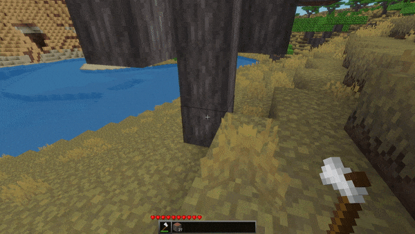

# THIS REPO IS OUTDATED

Moved here: https://notabug.org/minetestia/simple_woodcutter

# Simple Woodcutter

This mod chops the whole tree if you are holding an axe.

The chopping process stops if:

- You are too far away from the target (40 blocks by default)
- You take the axe out of your hand
- Your axe is destroyed
- You are dead
- You are out of the game
- You are holding ctrl or shift key down (this behavior can be reversed in
  settings)

## Features

- Super simple (~50 lines of code with extra features, translations and
  settings, but core functionality is just 10-15 lines).
- Compatible with any game or mod
- Works fine with huge trees (increase `max_distance` and `max_radius` if
  needed)
- Recognizes trees and tools by their group, so it does not require any
  configuration
- I you don't have the `lumberjack` permission (in multiplayer game), trees will
  be cut 100 times slower (you can change the default `delay` in settings)

## Latest update notes

Since version `1.2.0`, chopping trees is performed with a new, more accurate
algorithm that handles trees of all sizes and shapes! 🎉

---

This mod was created in [Minetestia Forge].

All my mods uses [Minetest LSP-API] annotations, [StyLua] and [Luacheck].

[Minetestia Forge]: https://github.com/orgs/minetestia/repositories
[Minetest LSP-API]: https://github.com/minetest-toolkit/minetest-lsp-api
[StyLua]: https://github.com/JohnnyMorganz/StyLua
[Luacheck]: https://github.com/mpeterv/luacheck
